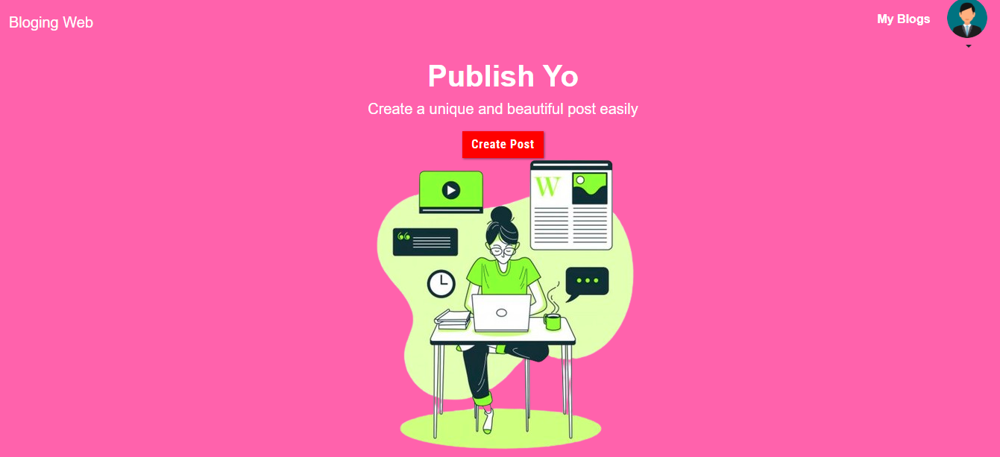
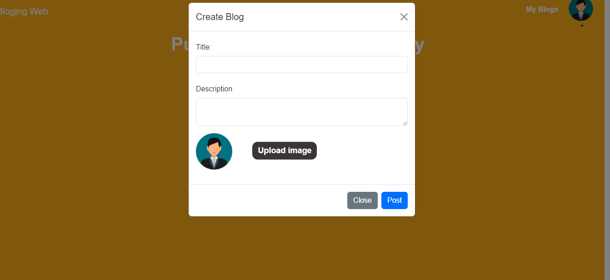
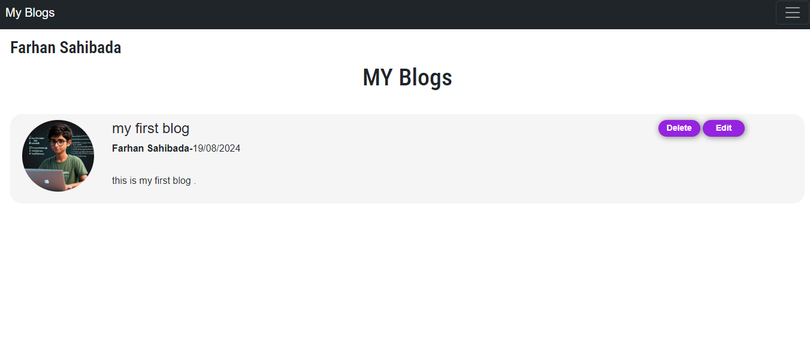
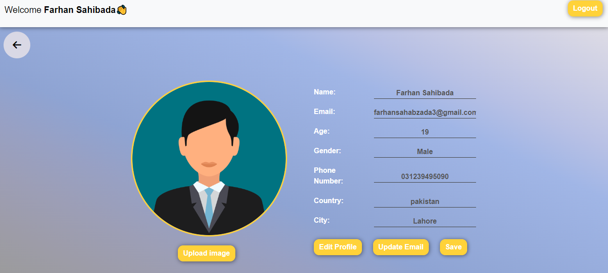
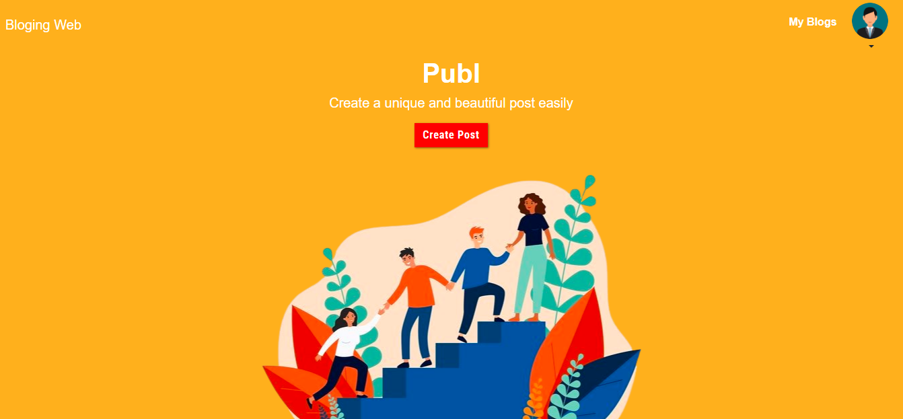

# ✍️ Professional Blogging Platform ✍️

## Welcome to the Professional Blogging Platform!

This project is a full-featured blogging website that allows users to create, manage, and share their blogs with ease. The platform includes user-friendly tools for uploading blogs, editing content, deleting posts, and adding images to enhance the visual appeal of each blog.

### Screenshot:

### Features:

- **Full Blog Management**: Users can create, edit, delete, and upload their blogs with ease.
  - 
  - 
  
- **Image Integration**: Add beautiful images to your blogs to make them more engaging.
  - 
  
- **Profile Access**: Personalized profile sections where users can manage their information.
  - 
    
- **User-Friendly Interface**: Intuitive navigation and a clean, professional design.
  - 

### Technologies Used:

- **HTML5**: For the structure and content layout.
- **CSS3**: For styling and responsive design, including Flexbox and Grid.
- **JavaScript**: For interactive features and dynamic content.
- **Firebase**: For user authentication, database management, and file storage.

### Live Demo

Check out the live demo of the professional blogging platform [here](https://farhansahibzada.github.io/Bloging-Web/).

### Contact

For any questions or feedback, feel free to reach out to me:

- **Name**: [Farhan Sahibzada]
- **Email**: [farhansahabzada3@gmail.com]
- **GitHub**: [https://github.com/YourUsername](https://github.com/FarhanSahibzada)
